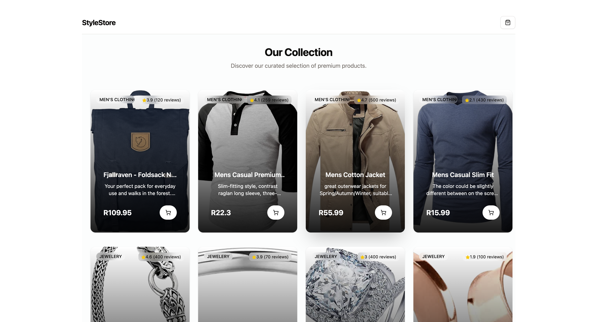
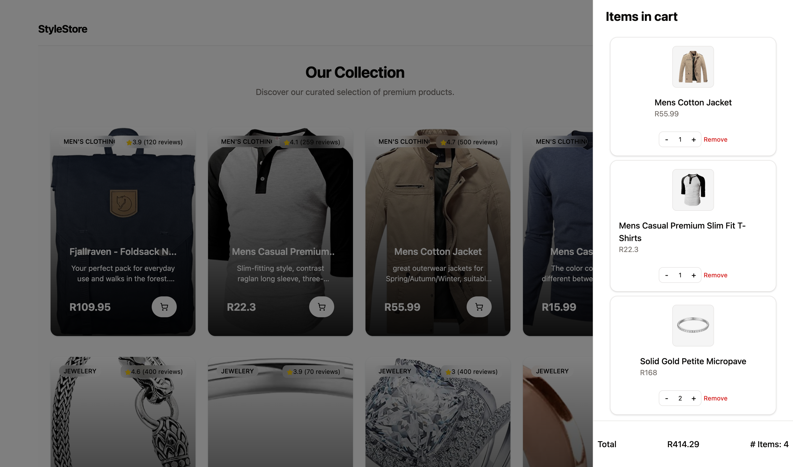
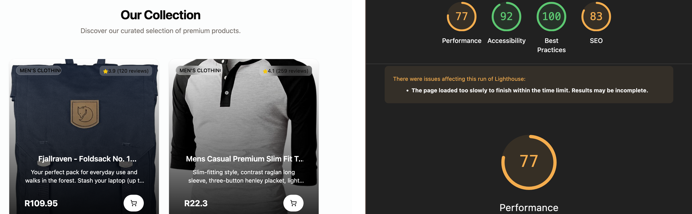

# Shopping Cart App

A modern, interactive shopping cart application built with React and TypeScript, with Tailwind and Shadcn. Browse products, manage your cart, and see real-time updates of your total.

## What It Should Do

- **Display a list of products** - Browse at least 4 different products with details like name, price, and description
- **Add items to cart** - Click to add any product to your shopping cart
- **Remove items from cart** - Delete unwanted items from your cart
- **Adjust quantities** - Increase or decrease the quantity of items in your cart
- **Cart summary** - View a real-time summary showing total items and total price

## Features

- Clean, user-friendly interface
- Real-time cart updates
- Responsive design
- Persistent cart state
- Use of api https://fakestoreapi.com/ to fetch porudct data
## Getting Started

### Prerequisites
- Node.js (v16 or higher)
- npm or yarn

### Installation

```bash
npm install
```

### Development

```bash
npm run dev
```

### Build

```bash
npm run build
```

## Tech Stack

- **React** - UI framework
- **TypeScript** - Type safety
- **Vite** - Build tool
- **Tailwind** - Styling
- **Shadcn** - UI component library

## Screens






## Lighthouse 


Performance is an issue as my API call takes long. To counter this, I used a `skeleton` component from Shadcn while loading products API. 